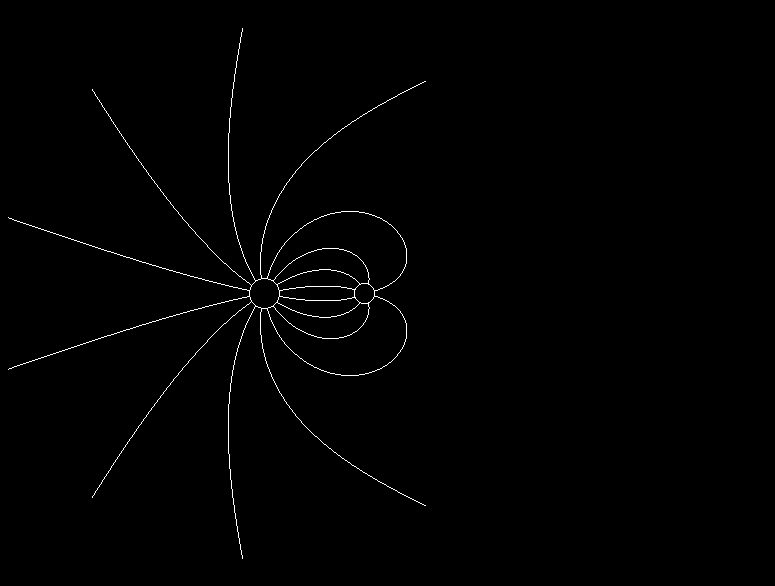

#### Phys-Visualizations

Drawings of Field / Interference Patterns for Various charge distributions using SDL_bgi

---

Note: Original scripts relied on the outdated Borland Graphics Interface (BG), bundled with several Borland compilers for DOS operating systems since 1987. I am using SDL_bgi as a replacement (package: libsdl-bgi-dev)

 * Can be compiled autonomously with: g++ <x>.cpp -o <x> -lSDL_bgi -lSDL2

