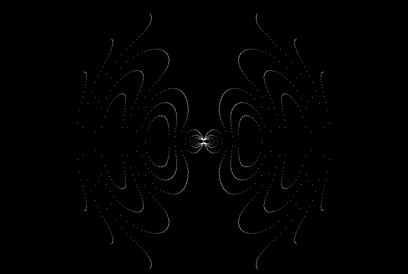

#### Phys-Visualizations

Drawings of Field / Interference Patterns for Various charge distributions using SDL_bgi

---  

Note: Original scripts relied on the outdated Borland Graphics Interface (BG), bundled with several Borland compilers for DOS operating systems since 1987. I am using SDL_bgi as a replacement (package: libsdl-bgi-dev)

 *Each Script can be compiled autonomously with: g++ [in].cpp -o [out] -lSDL_bgi -lSDL2*

For modern compilers, I transitioned from conio.h and instead have the scripts
rely on two conditions:

- getch() from SDL_bgi:
The SDL_bgi graphics library provides its own getch()-like function so that you can still pause and wait for a key without using conio.h.

- A Custom kbhit() Implementation:
For non-blocking key detection (similar to conio.h’s kbhit()), I just used <unistd.h> (standard on unix-like OS). 

